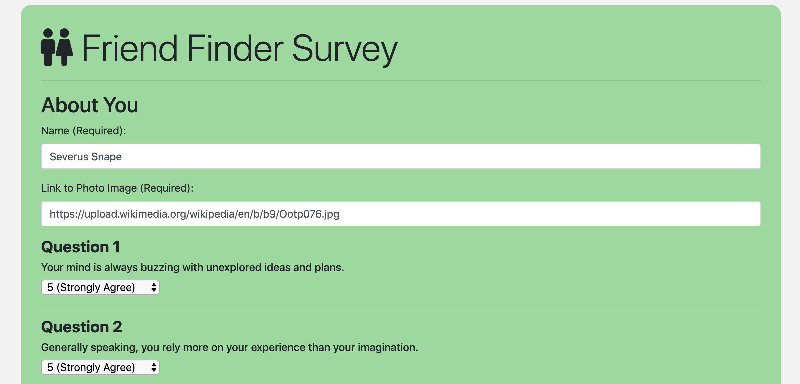

# Friend-Finder

## Overview
Friend Finder is a dating app. This full stack site takes the results from the users' surveys and then compare their answers with those of other users. The app will then display the name and picture of the user that best matches.

## Usage
The Friend Finder app is deployed on Heroku. User must go to https://friend-finder-86.herokuapp.com/ to view the app. This will load the homepage which allows the user to start the survery by pressing the "Go to survery" button or going to https://friend-finder-86.herokuapp.com/survey. User must fill out the form and then hit submit. Friend finder will then compare the results from the users' survey with results from other users and find a best match and return the result in a modal window. Users' survey results are with the other users' results.

### The Routes
* "/survey" will route the user to the survey page
* "/" or anything else that is not defined will route the user to the home page
* "/api/friends" will route the user to a list of all possible friends in JSON format

## Examples
### Images:

Screenshot of the Homepage

Screenshot of the Survey

Screenshot of the Best Match Results 

## Technologies
The Friend Finder app was created using these technologies
* JavaScipt
* JQuery
* Node.js
* Heroku
* NPM Packages
    * Express
    * Path
* 

## GITHUB
[github link](https://github.com/saronnhong/friend-finder)

## My Role
My role in the app development was to create the Friend Finder app based on instructions from UCSD Extension Full Stack Bootcamp. 
 